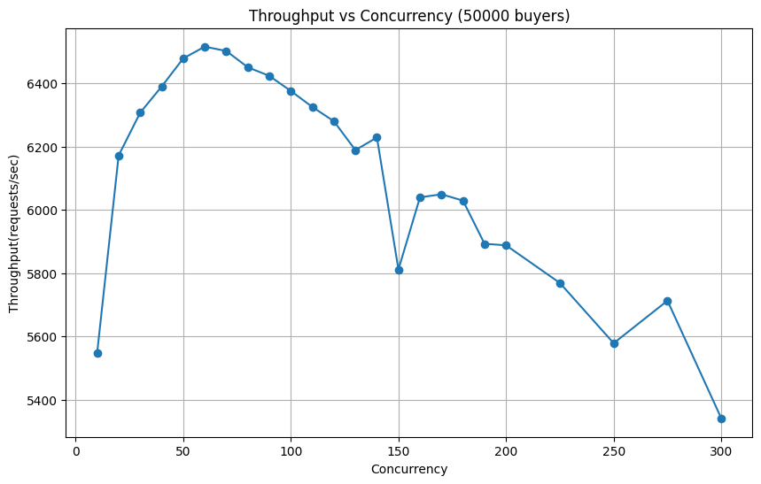
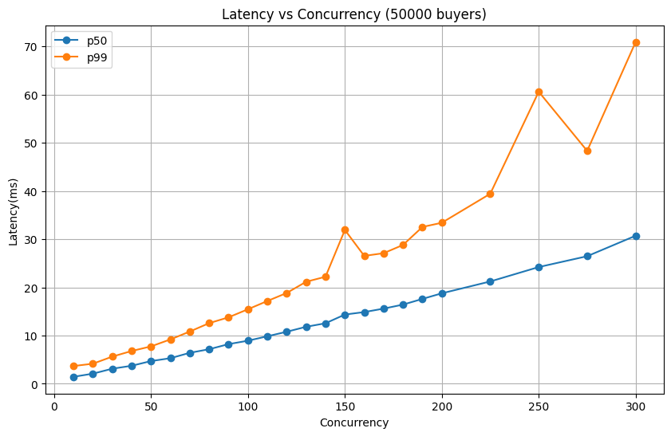
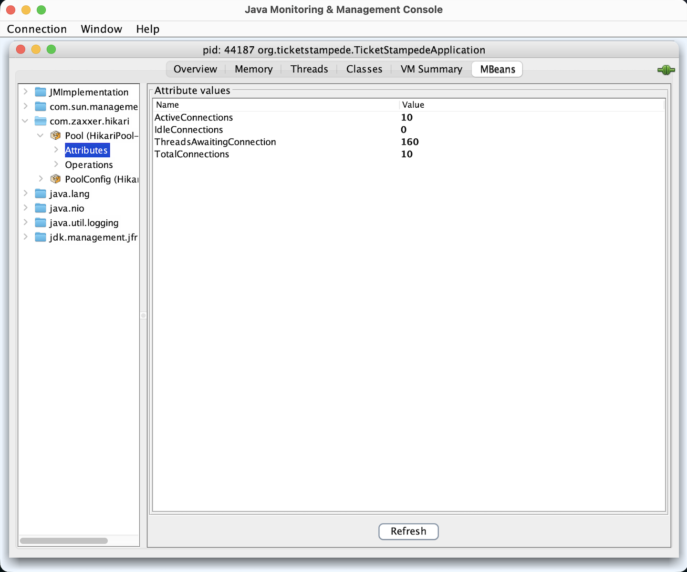
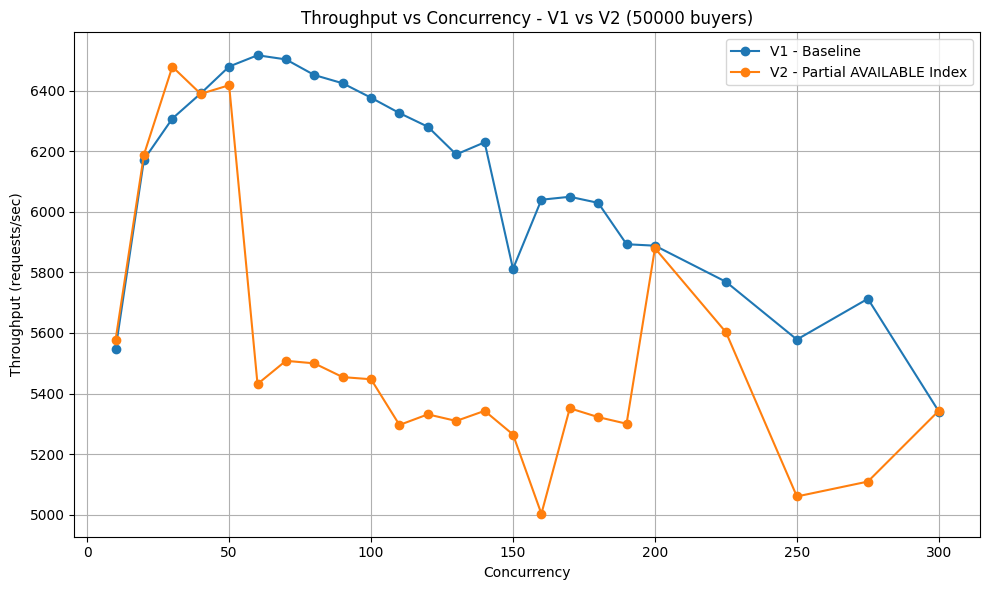
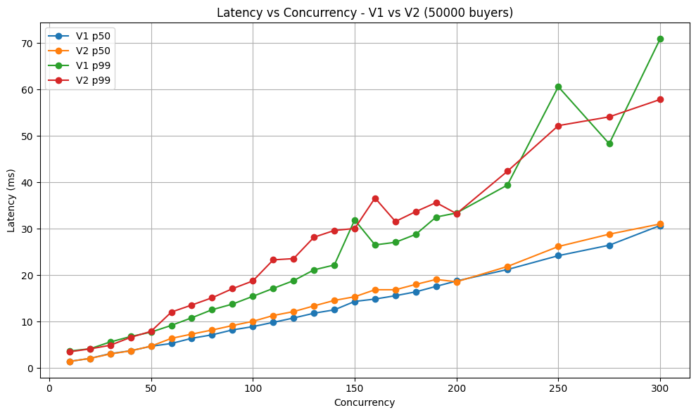
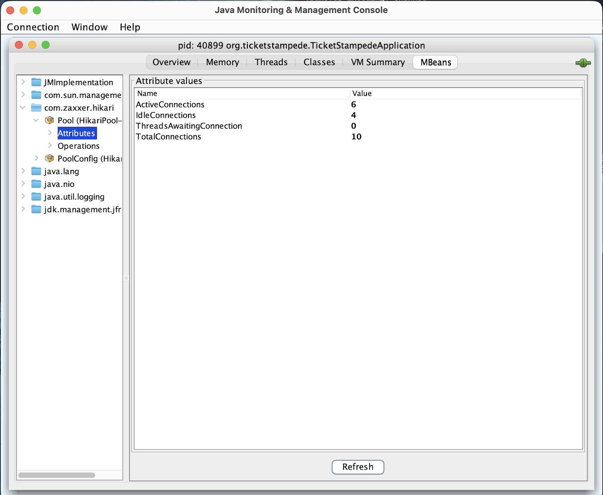

# Performance Investigation

## 1. Test Setup
The seller service was tested using the project's asynchronous buyer/load client against a local PostgreSQL instance.

The primary performance workload used:

| Parameter | Value |
|---|---:|
| Ticket capacity | 100 |
| Buyers | 50,000 |
| HTTP buy requests | 66,666 |
| Concurrency | 10–300 |
| HikariCP connection pool | 10 connections |

Each buyer generated a unique purchase request. To exercise idempotency under load, every third buyer also generated a duplicate request using the same `userId` and `requestId`. This resulted in 66,666 HTTP requests for 50,000 logical purchase attempts.

For each concurrency level, the load client:

1. Reset the sale with 100 available tickets.
2. Submitted the generated purchase requests.
3. Recorded the latency of each HTTP request.
4. Retrieved `/status` after the workload completed.
5. Verified the ticket-sale invariants against the observed responses and final server state.

The following performance metrics were recorded:

- Throughput        - completed HTTP requests per second.
- p50 latency       - median request latency.
- p99 latency       - 99th-percentile request latency.
- Error count       - non-successful HTTP responses observed during the workload.
- Invariant result  - whether all correctness checks passed.

The load client verified that:

- The number of issued tickets never exceeded the configured capacity.
- No ticket number was issued more than once.
- A duplicate `requestId` never resulted in a second ticket allocation.
- The tickets reported by `/status` matched the tickets observed as successfully purchased by the load client.

The performance experiments used a simulated payment implementation with a randomized latency(upto 20ms) and a 2% retryable failure probability.

## 2. Baseline Performance

The initial workload was run across concurrency levels from 10 to 300 using the V1 database schema.



Throughput initially increased as concurrency increased, from approximately 5,500 requests/second at concurrency 10 to a peak of approximately 6,500 requests/second at concurrency 60.

Beyond this point, increasing concurrency did not improve throughput. Throughput gradualy declined at higher concurrency levels, reaching approximately 5,300 requests/second at concurrency 300.



Latency increased as concurrency increased.

p50 latency rose from approximately 1.44 ms at concurrency 10 to 30.72 ms at concurrency 300. 

The p99 latency increased from approximately 3.68 ms to 70.92 ms over the same range.

All correctness invariants passed at every tested concurrency level.

The baseline therefore showed a saturation region around concurrency 50–70: additional concurrency no longer produced higher throughput, while request latency continued to increase.

## 3. Bottleneck Investigation

The baseline results showed that increasing concurrency beyond  50–70 no longer increased throughput, while request latency continued to rise. 
The next step was to identify where requests were spending time under higher concurrency.

### 3.1 Database Connection Pool

HikariCP metrics were observed through JMX while running the normal workload at concurrency 200.



During the workload, the connection pool showed:

| Metric | Observed value |
|---|---:|
| Total connections | 10 |
| Active connections | 10 |
| Idle connections | 0 |
| Threads awaiting connection | 160 |

All 10 database connections were active, with no idle connections available and a large number of threads waiting to acquire a connection.

This coincided with the region in which additional concurrency no longer produced higher throughput and instead increased latency. This identified database connection availability as a saturation point in the request path.

However, this observation alone does not establish the connection pool size itself as the root cause. Connections may remain occupied because of transaction duration, database queries, row-lock contention, or other work performed while a transaction is active.

### 3.2 Payment Latency Check

A diagnostic run was performed with the simulated payment delay removed and the payment failure probability set to 0.

Removing the payment delay did not eliminate the throughput saturation at higher concurrency. 
Throughput remained in approximately the same overall range, 
this indicates that the simulated payment latency was not the primary cause of the observed degradation.

This shifted the investigation toward the database work performed inside the purchase transaction.

## 4. Database Query Investigation

The purchase transaction repeatedly queries for an available ticket using `FOR UPDATE SKIP LOCKED`.
When no unlocked ticket is returned, a second query checks whether an AVAILABLE ticket still exists before deciding whether the sale is genuinely sold out or the remaining tickets are temporarily locked by other transactions.

### 4.1 V1 Query Plan

In V1, there was no index specifically targeting AVAILABLE tickets. PostgreSQL used the existing `(sale_version_id, ticket_number)` index to locate tickets belonging to the sale and then filtered them by status.

`EXPLAIN (ANALYZE, BUFFERS)` was captured after all 100 tickets in the sale had been sold.

For the ticket acquisition query, the V1 plan showed:

- `Bitmap Index Scan` using `uk_ticket_sale_version_number`
- `Bitmap Heap Scan` on the ticket table
- 100 rows removed by the `status = 'AVAILABLE'` filter
- 16 shared buffer hits for the overall query
- Execution time of 0.136 ms

The availability check followed a similar path:

- 100 rows removed by the status filter
- 13 shared buffer hits
- 11 heap blocks visited
- Execution time of 0.082 ms

The full query plans are preserved in [`explain/v1.txt`](explain/v1.txt).

Although these queries were already fast for an inventory of only 100 tickets, the plans showed unnecessary work after the sale had sold out: PostgreSQL located the sale's tickets and then filtered SOLD tickets while searching for an AVAILABLE one.

### 4.2 Partial Index

To make the access path match the query, V2 introduced a partial index containing only AVAILABLE tickets:

```sql
CREATE INDEX idx_ticket_available_by_sale
    ON ticket (sale_version_id, ticket_number)
    WHERE status = 'AVAILABLE';
```

V1:

13 buffer hits\
11 heap blocks\
100 rows filtered

V2:

2 buffer hits\
0 heap fetches\
Index Only Scan

The partial index contains entries only for tickets whose status is `AVAILABLE`. As tickets are sold, they no longer appear in this index.

This allows PostgreSQL to search directly among available tickets instead of locating all tickets for a sale and filtering out the sold ones.

After adding the partial index, the ticket acquisition query used:

- `Index Scan` using `idx_ticket_available_by_sale`
- 2 buffer accesses in the captured plan

The availability check used:

- `Index Only Scan` using `idx_ticket_available_by_sale`
- 2 shared buffer hits
- 0 heap fetches
- Execution time of 0.060 ms

The full query plans are preserved in [`explain/v2.txt`](explain/v2.txt).

For the availability check, the change can be summarized as:

| Metric | V1 | V2 |
|---|---:|---:|
| Buffer hits | 13 | 2 |
| Rows removed by status filter | 100 | 0 |
| Heap blocks/fetches | 11 blocks visited | 0 heap fetches |
| Access path | Bitmap Heap Scan | Index Only Scan |

The partial index therefore reduced the amount of database work required to determine whether an AVAILABLE ticket existed.

However, improving an individual query does not necessarily improve end-to-end application performance. The workload was rerun with the V2 schema to measure whether this change affected overall throughput and latency.

## 5. End-to-End Impact of the Partial Index

The same 50,000-buyer workload and concurrency sweep were repeated with the V2 schema. The application configuration, connection pool, workload generation, and simulated payment behavior were kept unchanged.



The V2 results did not show a consistent throughput improvement over V1. At some concurrency levels V2 was faster, while at others V1 was faster.

At concurrency 200, for example:

| Metric | V1 | V2 |
|---|---:|---:|
| Throughput | 5,888.04 req/s | 5,879.53 req/s |
| p50 latency | 18.77 ms | 18.59 ms |
| p99 latency | 33.41 ms | 33.26 ms |

The results at concurrency 200 were effectively unchanged despite the improved query plan.



Across the full concurrency sweep, there was no consistent reduction in latency or increase in throughput after introducing the partial index.

This indicates that although the partial index reduced the work performed by the AVAILABLE-ticket queries, those queries were not the dominant end-to-end bottleneck for a sale containing only 100 tickets.

The experiment also demonstrates why the query-plan improvement and application-level performance should be evaluated separately: `EXPLAIN ANALYZE` confirmed that the database access path improved, but the full workload showed that the optimization alone was not sufficient to materially change overall throughput.

## 6. Slow Datastore Experiment

To evaluate the behavior of the service under a severely degraded datastore, a temporary 10-second PostgreSQL delay was introduced inside the purchase transaction.

A smaller workload was used so that the behavior of the connection pool and request latency could be observed clearly:

| Parameter | Value |
|---|---:|
| Ticket capacity | 100 |
| Buyers | 20 |
| HTTP buy requests | 26 |
| Concurrency | 20 |
| Simulated datastore delay | 10 seconds |
| Hikari connection pool | 10 connections |

The workload produced the following results:

| Metric | Result |
|---|---:|
| Duration | 30.19 s |
| Throughput | 0.86 req/s |
| p50 latency | 10,089 ms |
| p99 latency | 20,128 ms |
| Purchased tickets | 19 |
| Errors | 2 |
| Correctness invariants | PASS |

The two errors were retryable payment failures from the simulated payment implementation.

### 6.1 Connection Pool Behavior

During the datastore slowdown, HikariCP reached:

| Metric | Observed value |
|---|---:|
| Total connections | 10 |
| Active connections | 10 |
| Idle connections | 0 |
| Threads awaiting connection | 10 |


The first requests occupied all 10 database connections while waiting on the delayed datastore operation. Additional requests therefore had to wait for a connection before they could continue.

This is reflected in the latency distribution. The p50 latency was approximately 10 seconds, while p99 reached approximately 20 seconds as some requests waited behind transactions already occupying the connection pool.

After the delayed transactions completed, the pool recovered:



At the observed recovery point, the pool contained 6 active connections and 4 idle connections, with no threads waiting for a connection.

### 6.2 Correctness Under Degradation

Despite the severe increase in latency and reduction in throughput, all ticket-sale correctness invariants continued to pass.

The service did not oversell tickets, issue duplicate ticket numbers, violate request idempotency, or report a `/status` result inconsistent with the successfully issued tickets.

The experiment shows that datastore slowdown primarily affected availability and latency.

## 7. Conclusions

The performance investigation showed that the service maintained its correctness guarantees across all tested concurrency levels, including under severe datastore degradation.

The main observations were:

- Baseline throughput increased up to approximately concurrency 50–70, after which additional concurrency primarily increased latency rather than throughput.
- At concurrency 200, all 10 HikariCP connections were active and 160 threads were observed waiting for a connection, identifying database connection availability as a saturation point.
- Removing the simulated payment latency did not remove the throughput saturation, indicating that payment simulation was not the primary cause.
- The V1 AVAILABLE-ticket queries performed unnecessary work after tickets had been sold. A partial index reduced this work and produced more efficient query plans.
- Despite the improved database access path, controlled V1/V2 benchmarks showed no consistent end-to-end throughput or latency improvement. With only 100 tickets, the optimized queries were not the dominant bottleneck.
- Introducing a 10-second datastore delay caused throughput to fall to approximately 0.86 requests/second and increased p50 and p99 latency to approximately 10 and 20 seconds respectively.
- Even under the 10-second datastore slowdown, all ticket-sale correctness invariants continued to pass.

Overall, the experiments show a distinction between correctness, query efficiency, and end-to-end performance. PostgreSQL transactions and constraints preserved the ticket-sale invariants under concurrency and datastore degradation.